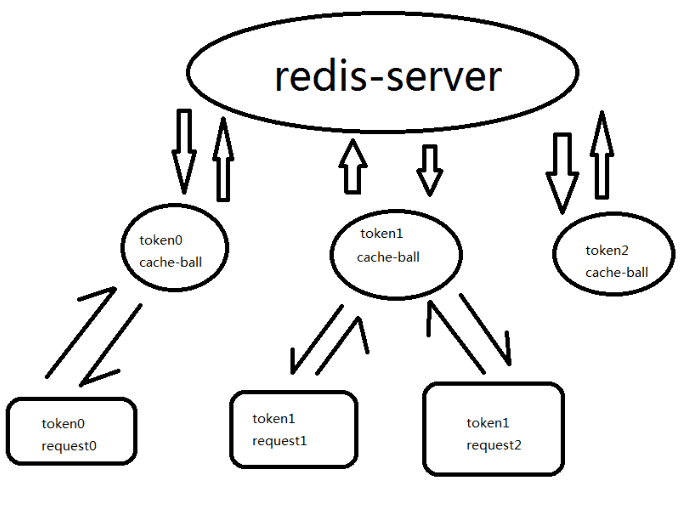
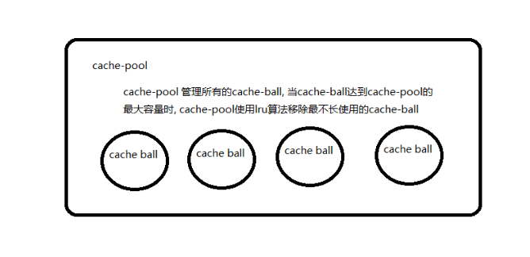

#### gin-session

* gin-session 一个为gin框架开发的session中间件, 使用redis储存数据, 并且底层维护了一个cache, 大量减小了对redis的读操作 。
* gin-session 保证请求前和请求后, session数据的一致性和完整性, 不保证请求执行过程中数据实时同步。

##### 安装

```shell
go get github.com/loop-xxx/gin-session
```

##### 架构



##### lru算法实现

```go
type Pool struct{
	//同步锁
	rwm sync.RWMutex

	//用于lru算法, 双向循环链表
	lru  *cacheNode
	//用于根据token找到对应cacheNode, hash表
	hash map[string]*cacheNode

	//cachePool的最大容量
	maxSize int
}

func (cpp *Pool)SearchCacheBall(token string)(cacheBall *Ball, exist bool){
	cpp.rwm.RLock()
	defer cpp.rwm.RUnlock()

	if cacheNode, ok := cpp.hash[token]; ok{ //通过hash表快速找到要访问的元素
		//进入修改模式
		cpp.rwm.RUnlock()
		cpp.rwm.Lock()

        //将被访问的元素提升到双向循环链表的队首
		first(cpp.lru, cacheNode) 

		//推出修改模式
		cpp.rwm.Unlock()
		cpp.rwm.RLock()

		exist = true
		cacheBall = cacheNode.core
	}
	return
}


func (cpp *Pool)AppendCacheBall(token string, cacheBall *Ball){
	cpp.rwm.Lock()
	defer cpp.rwm.Unlock()

	if len(cpp.hash) >= cpp.maxSize{
		//如果CachePool已经满了,则删除池中最不常用的cacheNode
		delete(cpp.hash, cpp.lru.prev.token) //双向循环列表的队尾是最不常使用的元素
		del(cpp.lru.prev)
	}
	cacheNode := &cacheNode{
		token: token,
		core:  cacheBall,
	}
	cpp.hash[token] = cacheNode
	push(cpp.lru, cacheNode)
}
```


##### 流程

```go
//1 获取请求携带的session
if token, err := ctx.Cookie("gin-session-id"); err == nil{
    //2 到pool中查找有没有对应的ball
    if cacheBall, exist := pool.SearchCacheBall(token); exist {
        ball = cacheBall
    }else{
        //3 如果未找到则创建新的ball, 并将其交给pool拓展
        //该token对应cache ball已经被lru算法移除, 
        //为该token创建新的cache bool并托管到cache pool
        ball = cache_pool.MakeCacheBall(
            fmt.Sprintf("gin-session:%s", token), 
            keeper, 
            expiration)
        pool.AppendCacheBall(token, ball)
    }

    //4 获取数据前, 先于redis同步以下数据
    if ball.Sync(){
    //5 同步成功后获取一个cache-ball保存的数据副本
        data = ball.Get()
    }else{
        //同步失败的原因:
        //keeper (redis)中的key-value不存在或已过期
        //keeper 底层错误(redis-server连接错误)
        //keeper 的实现代码有bug
        data = make(map[string]string, sessionInitSize)
    }
}
    
```

```go
//执行请求
ctx.Next()
//请求结束后判断副本数据是否被修改过, 若修改过提交到cache-ball, cache-ball也会主动同步到redis
if ginSession.Check(){
    ball.Commit(ginSession.Dump())
}
```

##### 参数介绍

```go
GinSessionManager(
    keeper, //底层为一个redis客户端
    domain, //web服务器的域名
    expiration, //session的超时时间默认 30 分钟
    poolMaxSize, //cache-pool的最大容积
    sessionMapInitSize, //一个空的session被初始化时的最初打下
)
```

##### 简单使用

```go
type User struct{
	FirstName string
	SecondName string
}

func main() {
	if keeper, err := dao.DefaultRedis("192.168.20.130:6379", "toor", 0); err == nil {
		engine := gin.Default()
		engine.Use(session.DefaultGinSessionManager(keeper, "localhost"))

		engine.GET("/login", func(ctx *gin.Context){
			if s, exist := session.GetSession(ctx); exist {
				s.Set("name", "loop")
				_= s.SetStruct("user", User{"li", "loop"})
			}
			ctx.String(http.StatusOK, "ok")
		})


		engine.GET("/show", func(ctx *gin.Context){
			if s, ok := session.GetSession(ctx); ok {
				if name , ok := s.Get("name"); ok{
					var u User
					if err := s.GetStruct("user",&u); err == nil{
						ctx.JSON(http.StatusOK, gin.H{"name": name,  "user":u})
					}
				}
			}
		})
		_ = engine.Run(":2333")
	}
}
```

